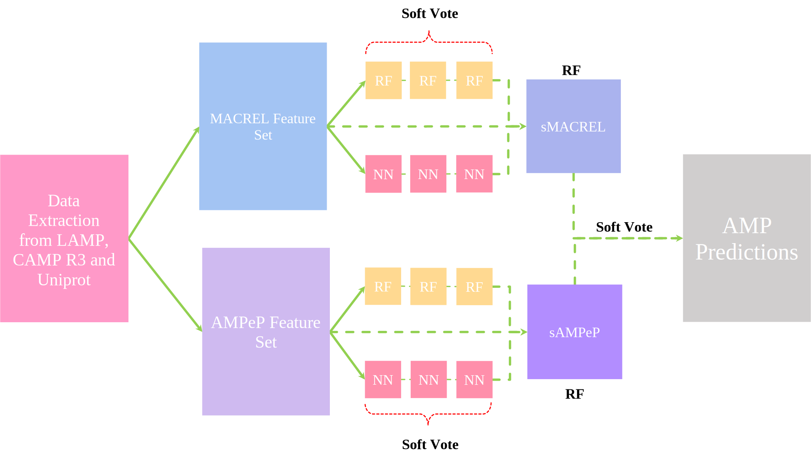

# A bit of background
## Antimicrobial Peptides
Antimicrobial Peptides (AMPs) are short peptide chains, usually 10 to 60 amino acids in length. AMPs can originate from plants, mammals, amphibians, insects, fungi, and bacteria Huan et al. (2020). Antimicrobial peptides are non-enzymatic, i.e. their mechanism of action is usually physical. Most AMPs have a positive charge on them (cationic nature) which allows them to disrupt bacterial membranes that are usually negatively charged or anionic in nature causing the cytoplasmic components to leak out of the cell Zhang et al. (2021), Benfield and Henriques (2020), Kumar et al. (2018).

Antimicrobial peptides are not highly conserved, database search tools like BLASTp often fail to find novel AMPs. Computational methods, specifically various machine learning algorithms have been used to identify new AMPs. Even though AMPs do not have a conserved amino acid sequence, they do still exhibit physicochemical properties that are characteristic to them. Various prediction tools use these properties to distinguish between AMPs and Non-AMPs. In 2009, CAMP was set up with multiple prediction tools, a Random Forest, a Support Vector Machine and a Discriminant Analysis model that were trained on 64 physicochemical features Thomas et al. (2009). In 2018, AMPeP was made public, it is a Random Forest Algorithm that was trained on 105 features the exact features will be discussed later as the AMPeP features have been used here Bhadra et al. (2018). DeepAMPeP30 is a neural network trained to predict short AMPs (<=30). In 2020, the MACREL pipeline was made available by Santos-Júnior et al. (2020), the classifier in the MACREL pipeline was trained on 22 features, two being repurposed from AMPeP with 3 being novel. While the MACREL classifier has a high precision, it did come at the cost of recall (how many AMPs it was able to detect).

### AMPeP Features
The AMPeP feature set described by Bhadra et al. (2018) can be broadly divided into 7 major descriptors, these descriptors divide amino acids into three classes, class1, class2 and class3. A score is calculated based on the position of amino acids at the first position, 25% residue, 50% residue, 75% residue, and 100% residue of a class in a peptide chain. These descriptors are
1.	**Hydrophobicity:** Divides the amino acids into three classes, class1 for polar amino acids, class2 for neutral amino acids, and class3 for hydrophobic amino acids. 
2.	**Normalized van der Waals Volume:** In this case it is the volume occupied by a molecule that is enclosed within a van der Waals surface. These are experimentally derived, but for this study they were obtained from Table 7 provided by Bhadra et al. (2018). The descriptor divides the amino acids into three classes based on the volume occupied, class1 for amino acids with a volume in the range 0 - 2.78, class2 for the range 2.95 - 4.0, and class3 for the range 4.03 - 8.08.
3.	**Polarity:** It is the distribution of charges present on an amino acid, higher polarity implies that the charges are unevenly distributed on the molecule giving it a partial positive and partial negative charge. This distributor divides the amino acids into three classes based on the polarity values, class1 has amino acids with a polarity values ranging from 4.9 - 6.2, class2 for the range 8.0 - 9.2, and class3 for the range 10.4 - 13. As one would expect these descriptors strongly correlate with the Hydrophobicity descriptors (see Figure 1)
4.	**Polarizability:** It is defined as the ability of a molecule to develop a dipole in the presence of an electric field. Higher the value, the easier it is to induce a dipole. Class1 for amino acids in the range 0 - 0.108, class2 for the range 0.128 - 0.186, and class3 for the range 0.219 - 0.409.
5.	**Charge:** Divides the amino acids based on their charge, class1 for positively charged amino acids, class2 for neutral amino acids and class3 for negatively charged amino acids
6.	**Solvent Accessibility:** Divides the amino acids based on their position in a peptide, class1 for amino acids that are buried, class2 for amino acids that are exposed, class3 for amino acids that are partially buried.
7.	**Secondary Structure:** Divides the amino acids based on their involvement in peptide secondary structure, class1 for amino acids involved in a helical structure, class2 for strands, and class3 for coils.

Figure 1: Correlogram of AMPeP Features

### MACREL Classifier Features
The MACREL Classifier feature set described by Santos-Júnior et al. (2020) can be divided into two main groups, Global descriptors and Local descriptors. The local descriptors are calculated based on the first occurrence of a residue in a peptide sequence.
1.	**Global Descriptors**
-	**Charge and Solubility:** Charge and isoelectric point of a peptide, calculated using the peptides library in python.
-	**Indexes:**
    -	**Instability Index:** Provides an estimate on protein stability. Calculated using the peptides library.
    -	**Boman Index:** Estimates the potential of a peptide to bind to a membrane or another protein. Calculated using the peptides library.
    -	**Aliphatic Index:** It is the volume occupied by aliphatic amino acids like Alanine, Isoleucine, Leucine, and Valine. Calculated using the peptides library.
-	**Hydrophobicity and Hydrophobic Moment:** Hydrophobic Moment is an estimate of amphiphilicity of a peptide and hydrophobicity is how soluble the peptide is in water.
-	**Amino Acid Composition:** These descriptors describe the physico-chemical properties of the peptides. These properties include, charge, and type of amino acid residue.
2.	**Local Descriptors**
-	**Free Energy of Transition:** It is the estimated change in free energy when a peptide moves from a random coil in an aqueous environment to an organized structure in a lipid environment. It can help estimate the likelihood of each amino acid to promote protein folding. FET divides the amino acids into three classes, class1 low energy change, class2 for moderate energy change, and class3 for high energy change.
-	**Solvent Accessibility:** As defined by Bhadra et al. (2018)

### References
- Huan, Y., Kong, Q., Mou, H., & Yi, H. (2020). Antimicrobial Peptides: Classification, Design, Application and Research Progress in Multiple Fields. Frontiers in Microbiology, 11. https://doi.org/10.3389/fmicb.2020.582779
- Zhang, Q.-Y., Yan, Z.-B., Meng, Y.-M., Hong, X.-Y., Shao, G., Ma, J.-J., Cheng, X.-R., Liu, J., Kang, J., & Fu, C.-Y. (2021). Antimicrobial peptides: mechanism of action, activity and clinical potential. Military Medical Research, 8(48), 48. https://doi.org/10.1186/s40779-021-00343-2
- Kumar, P., Kizhakkedathu, J., & Straus, S. (2018). Antimicrobial Peptides: Diversity, Mechanism of Action and Strategies to Improve the Activity and Biocompatibility In Vivo. Biomolecules, 8(1), 4. https://doi.org/10.3390/biom8010004
- Benfield, A. H., & Henriques, S. T. (2020). Mode-of-Action of Antimicrobial Peptides: Membrane Disruption vs. Intracellular Mechanisms. Frontiers in Medical Technology, 2. https://doi.org/10.3389/fmedt.2020.610997
- Bhadra, P., Yan, J., Li, J., Fong, S., & Siu, S. W. I. (2018). AmPEP: Sequence-based prediction of antimicrobial peptides using distribution patterns of amino acid properties and random forest. Scientific Reports, 8(1). https://doi.org/10.1038/s41598-018-19752-w
- Santos-Júnior, C. D., Pan, S., Zhao, X.-M., & Coelho, L. P. (2020). Macrel: antimicrobial peptide screening in genomes and metagenomes. PeerJ, 8, e10555. https://doi.org/10.7717/peerj.10555

# The sAMPC function file and Installation
Before we proceed it must be made clear that a lot of work still needs to be done on sAMPC and the code is still very experimental.

### sAMPC: Stacked Antimicrobial Peptide Classifier
sAMPC is an ensemble model based on the feature sets described in the AMPeP and MACREL papers. The sAMPC function file contains 5 main functions, they are `macrel_feature_extract()`, `ampep_feature_extract()`, `user_data_training()`, `stack_train()`, and `stack_predictions()`.

Figure 2: sAMPC Workflow

